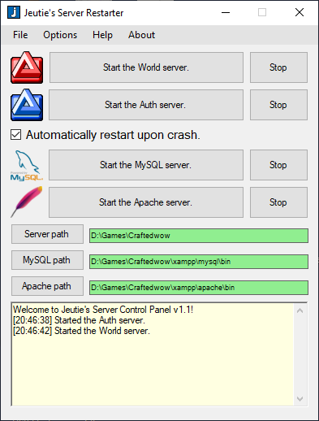

# Jeutie's Server Control

WoW Server Restarter. A simple but usefull tool to automatically restart MySQL , Apache but also World and Auth emulator server processes.

How to run:
+ 1 - [Download the Jeutie's Server Control.exe from the Binary folder](https://github.com/CraftedRO/Jeutie-s-Server-Control/raw/main/Binary/JeutiesServerControl.exe).
+ 2 - Run Jeutie's Server Control.exe and point the patches for each server

